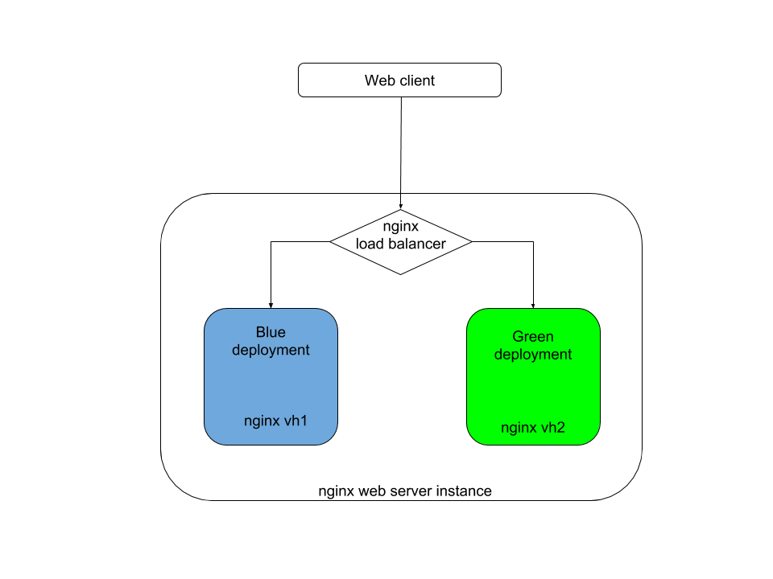

# Blue Green Deployment

Simple proof of concept of blue-green-deployment strategy with:

- Vagrant for development environment
- Dummy nginx web server application (serves as demo app)
- Bash shell script (manages the deployment)
- Nginx as a load-balancer (provides easy & fast switching between backends)

### Requirements:

- vagrant
- git
- virtualbox

## How to run

* Get the repo and bring up the environment

```
git clone https://github.com/achuchulev/blue-green-deployment.git
cd blue-green-deployment
vagrant up
```

* Run `vagrant up` that will spin up a virtualbox vm and execute script that:

```
./scripts/nginx_config.sh # install and configure nginx and tools
```

### Manage deployments

```
vagrant ssh
cd /vagrant/scripts

# manage deployments using blue, green or blue-green as argument
./deployment.sh argument
```


